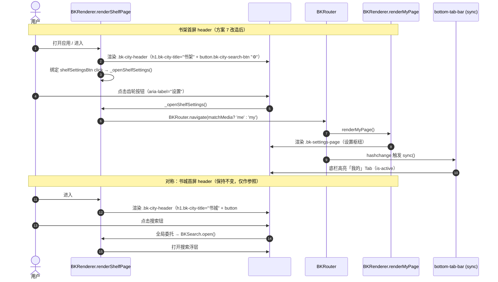

# 书城重设计 · 方案 7 增量设计文档（书架首屏 header 与书城 header 首屏 parity）

> 本文档为**增量开发设计**，仅覆盖方案 7（书架首屏 header 对齐书城 header）+ 方案 6 遗留 follow-up（`.series-cache-info` 令牌化）。
> **真理源**：`src/static/`（`index.html` + `js/` + `css/style.css`）。本次只改 `src/static/`。
> **设计系统**：Soft Nordic（已落地）。palette：sage 品牌 `#3D8A5A`（`--brand`）、muted `#9A958C`（`--text-muted`）、文字 `#1A1918`（`--text`）、边框 `#E5E2DD`（`--border`）、卡 `#FFFFFF`（`--card-bg`/`--surface`）、画布 `#F5F4F1`。
> **不覆盖原则**：不修改 `docs/system_design.md` / `docs/bookcity-a11y-token-design.md`。本增量设计落在新文件 `docs/bookcity-parity-design.md`。
> **约束**：本次仅产出设计与任务分解，不实施源码改动；下文「目标代码」为规格示例（spec），供 Engineer 落地参考。

---

## 1. 实现方案 + 框架选型

- **技术栈**：原生 JS（IIFE 模块，无框架、无构建步骤）+ 原生 CSS（设计令牌变量）。与现有 `src/static/` 代码库完全一致，**最小变更原则**。
- **核心思路**：把书架首屏 header 的 DOM 结构从「`.bk-settings-header`（返回按钮 + 裸 `<h1>`）」改为与书城**同构**的「`.bk-city-header`（`<h1 class="bk-city-title">` + 右侧 40px 圆形 action 钮）」，从而在两个首屏（书架 / 书城）实现 header 视觉与令牌体系的统一（parity）。
- **复用而非新增**：
  - CSS 完全复用 `.bk-city-header` / `.bk-city-title` / `.bk-city-search-btn` 三件套（仅新增一条作用域微调规则用于对齐）。
  - 齿轮按钮**直接复用 `.bk-city-search-btn` 样式**（仅图标 `⚙` 与 `aria-label="设置"` 不同），不新增独立 class。
  - 齿轮的点击行为**复用既有「我的」Tab 的入口逻辑**（`BKRouter.navigate('me'|'my')` → `renderMyPage()`），零新代码路径。
- **删除**：原 `‹ 返回` 按钮及其 `BKRouter.back()` 绑定（书架是首屏/主页，返回语义错误，决策④已确认首屏由书城改为书架）。

---

## 2. 文件清单

| 文件 | 改动类型 | 说明 |
|------|----------|------|
| `src/static/js/renderer.js` | 修改 | `renderShelfPage`（约 L3105–3165）header 结构改造 + 齿轮 handler 绑定；移除 `shelfBackBtn` 死代码 |
| `src/static/css/style.css` | 修改 | T03 新增 `.bk-shelf-page .bk-city-header` 对齐规则；可选移除已弃用 `.bk-shelf-page .bk-settings-header` 规则（L1786–1797）；T04 将 L246 `.series-cache-info` 硬编码令牌化 |
| `docs/bookcity-parity-design.md` | **新增** | 本设计文档（增量，不覆盖既有文档） |
| `tests/ui/test-shelf.js` 或 `tests/ui/test-bookcity.js` | 建议（QA 自写） | 新增首屏 header 断言用例（见 §6/T05） |

> 不改动 `index.html`、`router.js`、`bottom-tab-bar.js`、`theme-toggle.js` 等。

---

## 3. 现状事实（已 Read/Grep 实证，行号取自当前文件）

### 3.1 书架首屏 header（改造对象）
- `renderer.js` `renderShelfPage` L3114–3117：
  ```html
  <div class="bk-shelf-page">
    <div class="bk-settings-header">
      <button class="bk-back-btn" id="shelfBackBtn">‹ 返回</button>
      <h1>书架</h1></div>
  ```
- L3133–3134：`shelfBackBtn` 绑定 `BKRouter.back()`（语义错误：首屏不应有返回）。
- `.bk-shelf-page` 容器（`style.css` L1781–1785）：`max-width:720px; margin:0 auto; padding:0 16px ...` → 子元素统一距边 **16px**。
- `.bk-shelf-page .bk-settings-header`（`style.css` L1786–1791）：flex / align-center / gap 12px / `padding:16px 0 12px`（横向 0，依赖容器 16px）。
- `.bk-shelf-page .bk-settings-header h1`（L1792–1797）：`font-size:20px; font-weight:700; color:var(--heading,#1A1918)`。

### 3.2 书城首屏 header（parity 目标，保持不变）
- `renderer.js` `_renderCityHome` L2451–2453：
  ```html
  <div class="bk-city-page">
    <div class="bk-city-header">
      <h1 class="bk-city-title">书城</h1>
      <button type="button" id="bk-search-btn" class="bk-city-search-btn" aria-label="搜索">🔍</button>
    </div>
  ```
- `.bk-city-page`（`style.css` L2642–2645）：`min-height:100%; padding-bottom:88px` —— **无横向 padding**。
- `.bk-city-header`（L2647–2652）：`display:flex; align-items:center; justify-content:space-between; padding:8px 20px 4px`。
- `.bk-city-title`（L2653–2658）：`font-size:var(--text-xl,1.4rem); font-weight:700; color:var(--text); margin:0`。
- `.bk-city-search-btn`（L2659–2674）：`width/height:40px; border-radius:50%; border:1px var(--border); background:var(--card-bg,var(--surface)); color:var(--text-muted); font-size:18px; flex 居中; :active → background:var(--nav-hover); transform:scale(0.94)`。
- 搜索钮 handler（`renderer.js` L2648–2650，全局委托）：`if (win.BKSearch && win.BKSearch.open) win.BKSearch.open();`。

### 3.3 设置入口（齿轮按钮要复用的机制）
- 底部「我的」Tab（`bottom-tab-bar.js` L127–133）：
  ```js
  case 'mine':
    if (win.BKRouter) {
      var route = (win.matchMedia && win.matchMedia('(min-width: 768px)').matches) ? 'me' : 'my';
      win.BKRouter.navigate(route);
    }
    break;
  ```
- 路由映射（`router.js` L47–51）：`me`/`my` → `R.renderMyPage()`；`settings` → `R.renderFullSettingsPage()`。
- `renderMyPage`（`renderer.js` L2847）：渲染 `.bk-settings-page`（个人中心 / 设置枢纽），含阅读模式、字体大小、书签、清理数据、发送桌面、导入、下载管理、偏好设置、开发者等全部设置项——即应用内「设置」总入口。
- `renderFullSettingsPage`（`renderer.js` L2998）：独立「设置」整页（带「‹ 返回」、隐藏底栏）。

### 3.4 follow-up（方案 6 遗留）
- `style.css` L246：`.series-cache-info { font-size: var(--text-xs); color: #999; ... }` —— `color:#999` 为硬编码，应令牌化为 `var(--text-muted)`（与方案 6 令牌化纪律一致）。注意区分：这是书城系列缓存信息文字（`.series-cache-info`），非 `_buildBookCard` 的 `cache-status`（方案 6 已处理）。

---

## 4. 数据结构 / 接口

**无新数据结构 / 无新模块 / 无新函数签名。** 全部复用既有 API：

| 复用对象 | 用途 | 备注 |
|----------|------|------|
| `BKRenderer.renderShelfPage()` | 书架首屏渲染（改造点） | 首屏；`renderHome` 薄转发至此（L2765–2769） |
| `BKRenderer._renderCityHome()` | 书城首屏渲染（parity 参照，不改） | header 同构来源 |
| `BKRouter.navigate(route)` | 路由跳转（齿轮复用的入口） | `route` ∈ `{'me','my','settings',...}` |
| `BKRenderer.renderMyPage()` | 设置/个人中心页（齿轮目标） | 经 `me`/`my` 路由抵达 |
| `BKSearch.open()` | 书城搜索钮（对称参照） | 仅作流程对称性说明，不改 |
| `BKRouter.back()` | 原返回钮（将被删除） | 书架首屏不再需要 |

---

## 5. 调用流程（时序图）



---

## 6. 任务列表（有序、含依赖、按实现顺序）

> 规则：T01 为基础设施式改造（与常规前端模板不同，此处 T01 即首屏 header 结构改造，是后续 handler/CSS 的前提）。任务数 ≤5，按实现顺序。

### T01（P0）· 方案 7 — JS header 结构改造
- **源文件**：`src/static/js/renderer.js`（`renderShelfPage`，L3114–3117、L3133–3134）
- **依赖**：无
- **改动清单**：
  1. 将 L3115–3117 的 `.bk-settings-header`（含 `‹ 返回` + 裸 `<h1>书架</h1>`）替换为 `.bk-city-header` 同构结构：
     ```html
     <!-- 目标代码（spec） -->
     <div class="bk-shelf-page">
       <div class="bk-city-header">
         <h1 class="bk-city-title">书架</h1>
         <button type="button" id="shelfSettingsBtn" class="bk-city-search-btn" aria-label="设置">⚙</button>
       </div>
     ```
  2. 删除 L3133–3134 的 `shelfBackBtn` 返回绑定（节点已不存在，`getElementById` 返回 null，原 `if(backBtn)` 守卫已使其无害；此处一并清理死代码）。

### T02（P0）· 方案 7 — 齿轮 handler 绑定
- **源文件**：`src/static/js/renderer.js`（`renderShelfPage`，紧随 T01 之后）
- **依赖**：T01（需 `shelfSettingsBtn` 节点存在）
- **改动清单**：在 `app.innerHTML = html;` 之后、原 `shelfBackBtn` 绑定处，新增局部事件绑定（与既有 `bk-continue-viewall` 绑定同模式，互不冲突）：
  ```js
  // 目标代码（spec）—— 复用底部「我的」Tab 的入口逻辑
  var settingsBtn = document.getElementById('shelfSettingsBtn');
  if (settingsBtn) {
    settingsBtn.addEventListener('click', function () {
      if (win.BKRouter && typeof win.BKRouter.navigate === 'function') {
        var route = (win.matchMedia && win.matchMedia('(min-width: 768px)').matches) ? 'me' : 'my';
        win.BKRouter.navigate(route); // → renderMyPage()（设置枢纽）
      }
    });
  }
  ```
  - **不冲突说明**：齿轮为局部 `addEventListener`；书城搜索钮走全局 `#bk-search-btn` 委托。两者作用域分离，无重复触发。

### T03（P1）· 方案 7 — CSS 对齐微调
- **源文件**：`src/static/css/style.css`（新增作用域规则；可选清理 L1786–1797）
- **依赖**：T01（依赖 `.bk-city-header` 进入 `.bk-shelf-page`）
- **改动清单**：
  1. **新增**（放在 `.bk-city-search-btn:active` 附近或 `.bk-shelf-page` 区块）：
     ```css
     /* 方案 7：书架首屏 header 复用书城 .bk-city-header，横向内距对齐到 20px */
     .bk-shelf-page .bk-city-header {
       padding-left: 4px;
       padding-right: 4px; /* 容器 16px + 此处 4px = 20px，与书城 header 完全对齐 */
     }
     ```
  2. **可选清理**：`.bk-shelf-page .bk-settings-header`（L1786–1791）与 `.bk-shelf-page .bk-settings-header h1`（L1792–1797）在 T01 后已无引用，可删除（保持最小变更也可保留，但建议删除以免歧义）。
- **对齐结论**（回应待明确事项②）：
  - 书城 header 距边 = **20px**（`.bk-city-header` 自带 `padding:8px 20px 4px`，容器无横向 padding）。
  - 书架若直接塞入 `.bk-city-header` 且保留其 20px 横向 padding，则距边 = 容器 16px + 20px = **36px**（错位）。
  - 故用作用域规则把书架内 header 横向 padding 收为 4px → 16 + 4 = **20px**，达成 true parity。
  - 备选：若产品希望标题与书架内「继续阅读 / 我的书架」section 头部同节奏（16px），则用 `padding-left:0; padding-right:0`；但与书城差 4px，非严格 parity。**推荐 20px 对齐方案**。

### T04（P0）· follow-up — `.series-cache-info` 令牌化
- **源文件**：`src/static/css/style.css` L246
- **依赖**：无（独立，可与 T01 并行）
- **改动清单**：
  ```css
  /* 改前 */ .series-cache-info { font-size: var(--text-xs); color: #999; white-space: nowrap; flex-shrink: 0; }
  /* 改后 */ .series-cache-info { font-size: var(--text-xs); color: var(--text-muted); white-space: nowrap; flex-shrink: 0; }
  ```
  - 注意：仅改 `color`，不动 `font-size` 等；区别于 `_buildBookCard` 的 `cache-status`（方案 6 已处理）。

### T05（P1）· 测试对齐（建议，交给 QA 自写）
- **源文件**：`tests/ui/test-shelf.js` 或 `tests/ui/test-bookcity.js`（新增用例）
- **依赖**：T01、T02、T03
- **断言要点**（供 QA 参考，不需 Architect 实现）：
  - 书架首屏 header 含 `.bk-city-title` 且 `textContent === '书架'`。
  - 书架首屏 header 含右侧 40px 圆形 action 按钮（`.bk-city-search-btn`，`id="shelfSettingsBtn"`，`aria-label="设置"`）。
  - 书架首屏 **不再** 含 `.bk-back-btn` 或文本 `‹ 返回`。
  - 点击 `shelfSettingsBtn` 后 `location.hash` 变为 `#/me` 或 `#/my`，且 DOM 出现 `.bk-settings-page`（设置枢纽渲染）。
  - （regression）书城首屏 header 仍含 `.bk-city-title`（「书城」）与 `#bk-search-btn`，行为不变。

---

## 7. 依赖包

**无新增依赖。** 纯原生 JS + CSS，复用既有 `BKRouter` / `BKRenderer` / `BKSearch` / `bottom-tab-bar` 模块。

---

## 8. 共享知识（Cross-cutting）

- **Header 统一令牌体系**：书架与书城首屏 header 一律使用 `.bk-city-header` / `.bk-city-title` 结构，`color` 走 `var(--text)`，`font-size` 走 `var(--text-xl, 1.4rem)`。
- **右侧 action 钮规范**：统一 40px 圆形 `.bk-city-search-btn` 风格（`border:1px var(--border); background:var(--card-bg); color:var(--text-muted); border-radius:50%; :active → var(--nav-hover) + scale(0.94)`）。图标与 `aria-label` 按场景替换（🔍 搜索 / ⚙ 设置），**不新增 class**。
- **颜色纪律**：所有文字/边框/背景一律引用 Soft Nordic 令牌（`--text` / `--text-muted` / `--border` / `--card-bg` / `--brand` / `--nav-hover`），禁止硬编码 hex（本案 T04 即修复一处违规）。
- **入口复用纪律**：首屏内的「设置」入口统一走 `BKRouter.navigate('me'|'my')` → `renderMyPage()`，与底部「我的」Tab 行为完全一致，避免多套入口分裂。

---

## 9. 待明确事项 → 已明确结论

| # | 原待明确项 | 结论 |
|---|-----------|------|
| ① | 齿轮复用哪个设置入口？ | **复用底部「我的」Tab 的入口逻辑**：`BKRouter.navigate(matchMedia? 'me':'my')` → `renderMyPage()`。理由：最低耦合、零新代码路径、与底栏「我的」Tab 完全对称；`renderMyPage` 本身即是设置/个人中心枢纽（含全部设置项）。**兜底**：若产品要求齿轮直达「设置」整页，改 `navigate('settings')`（`renderFullSettingsPage`，带「‹ 返回」且隐藏底栏）——但会偏离「与底栏 Tab 对称」的一致性，非首选。 |
| ② | `.bk-shelf-page` 与 `.bk-city-page` 宽度差是否导致 header 不对齐？ | **会**。书城容器无横向 padding（header 自供 20px）；书架容器 `padding:0 16px`（子元素 16px）。直接塞 `.bk-city-header` 会错位到 36px。→ 用 T03 作用域规则 `.bk-shelf-page .bk-city-header { padding-left:4px; padding-right:4px }` 对齐到 **20px**（true parity）。 |
| ③ | 齿轮 handler 复用设置入口的风险 + 兜底？ | **低风险**：① 齿轮为局部 `addEventListener`，与书城全局 `#bk-search-btn` 委托互不干扰；② 导航到 `#/me`/`#/my` 后，`bottom-tab-bar` 经 `hashchange` 自动同步高亮「我的」，无需手动管理；③ `renderShelfPage` 是首屏、底栏常驻，无遮罩冲突。**兜底**：若未来 `renderMyPage` 被移除，则切换为 `navigate('settings')`。 |

---

## 附：实现顺序速查

```
T01 (P0) header 结构改造  ──┬──> T02 (P0) 齿轮 handler  ──> T03 (P1) CSS 对齐
T04 (P0) .series-cache-info 令牌化（独立，可并行）
                                                  └──> T05 (P1) QA 测试对齐（依赖 T01–T03）
```

> 说明：本增量仅产出设计与任务分解，源码改动由 Engineer 依据上方「目标代码（spec）」落地；不覆盖任何既有 `docs/` 文档。
