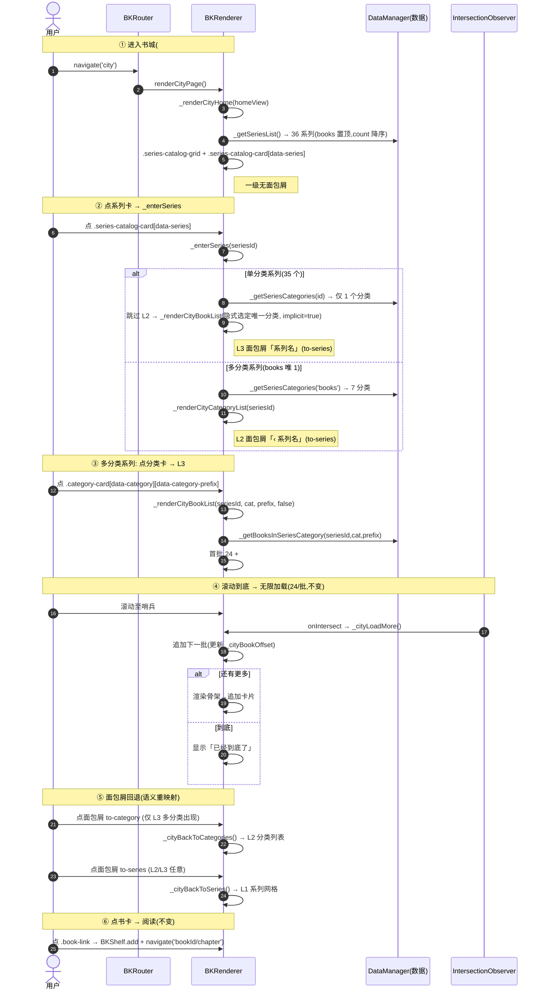
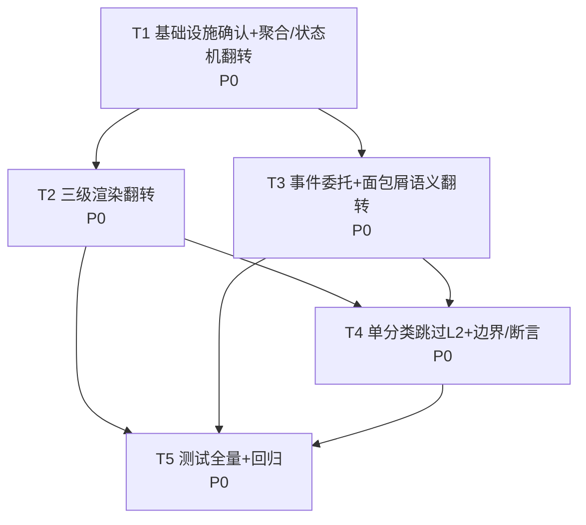

# 书城主轴翻转 · 增量架构设计 + 任务分解（系列 → 分类 → 书籍）

> 架构师：高见远（Bob）
> 交付对象：主理人齐活林（中转给工程师）
> 输入：team-lead 任务说明 + 现状核实（renderer.js 书城模块 ~2327 行起）+ 真实数据 `output/zl-data/books-index.json`（36 系列 / 1197 本）
> 真理源：`src/static/`（原生 JS SPA，无框架）；构建产物 `output/`(PWA) + `android/app/src/main/assets/public/`
> 设计系统：Soft Nordic（sage `#3D8A5A` 等 CSS 变量）
> 反向依据：旧 `.workbuddy/design-bookcity-redesign.md` 与 `.workbuddy/prd-bookcity-redesign.md` 描述的是「分类→系列→书籍」，本方案将其**整体反向**应用，不照抄旧方向。

---

## 〇、核心结论（先讲反转）

| 维度 | 旧（被反向） | 新（本次交付） |
|---|---|---|
| 下钻主轴 | 分类 → 系列 → 书籍 | **系列 → 分类 → 书籍** |
| L1 | 7 分类网格（`.category-card`） | **36 系列网格（`.series-catalog-card`，books 置顶）** |
| L2 | 某分类下系列列表（`.series-catalog-card`） | **某系列下分类列表（`.category-card`）** |
| L3 | 某系列在某分类下书籍列表 | 同左（逻辑等价） |
| 面包屑 | L2「‹ 分类名」/ L3「分类名 › 系列名」 | **L2「‹ 系列名」/ L3「系列名 › 分类名」** |
| 单分类系列 | 无跳过（每系列都先列系列） | **跳过 L2，直接进书籍列表** |

**数据已核实的关键事实（决定设计可简化）**：
- 36 系列**全部有书**（无 0 本系列），故 L1 稳定渲染 36 张系列卡。
- 仅 `books`（职事书报）1 个系列跨多分类（prefix 1,2,3,4,5,7,8，缺 6）；其余 35 系列**各自唯一归属 1 个分类**。
- 因此「单分类系列跳过 L2」覆盖 35 个系列，仅 `books` 走 L2 分类选择——翻转后 `books` 的「跨全部分类」特例**自然消解**（直接 `series==='books' && category_prefix===X` 过滤即可，无需反向把 books 塞进 7 个分类的二级列表）。
- 书「1001」真实 id 为 `books-1-1001`（title「1001-到底有没有神」），series=`books`、category=福音类、prefix=1。

---

## Part A：系统设计

### 1. 实现方案

#### 1.1 技术难点与框架选型
- **难点 1 — 主轴反向而基建可全复用**：既有 `.category-card` / `.series-catalog-card` / `.bk-city-*` / `.bk-crumb-*` 视觉钩子与 `_city*` 状态机、事件委托（`_bindCityEvents` + `closest` + keydown 对称）、无限滚动（`IntersectionObserver` 守卫 + `_cityLoadMore`）全部可复用。本次**只调换「哪一层用哪类卡 / 哪个聚合函数驱动哪一层」**，不引入新范式。
- **难点 2 — 聚合函数反向**：L1 由「从书聚合分类」改为「列出系列（`_getSeriesList`）」；L2 由「从分类聚合系列」改为「取某系列跨越的分类（`_getSeriesCategories`，优先读 series 的 `categories` 字段，回退从书聚合）」。L3 取书函数 `_getBooksInSeriesCategory` 与旧 `_getSeriesBooksInCategory` **逻辑等价**（`series===books && category_prefix===X` 过滤），仅改名。
- **难点 3 — 单分类系列跳过 L2（状态机需表达「隐式选定」）**：引入「`_cityCategory` 可为空（表示系列唯一分类已隐式选定）」的语义，使 `_cityLevel()` 在「已进系列 + 已定分类」时返回 3，在「已进系列 + 未定分类（多分类系列待选）」时返回 2。
- **选型**：**原生 JS + 模块级状态机 + `IntersectionObserver`**，零新增 npm 包（沿用旧 redesign 决策）。CSS 仅改文案「分类↔系列」，**不新增任何 CSS 类**。

#### 1.2 架构模式（与旧一致，仅层级语义互换）
- **视图层**：`BKRenderer` 的 `renderCityPage` 渲染进 `homeView`（`#/city` 单路由）。
- **状态层**：模块级 `_city*` 变量表达三级下钻状态机（不进 hash，刷新保留为 P2）。
- **事件层**：`_bindCityEvents(homeView)` 事件委托，重渲染 innerHTML 不丢失监听；卡片/面包屑选择器与 data-action 按新层级**重映射**（详见 §3、§8）。

### 2. 文件清单（仅增量改动）

| 文件 | 操作 | 说明 |
|---|---|---|
| `src/static/js/renderer.js` | 修改 | 翻转书城下钻轴：新增/改名聚合三件套（`_getSeriesList` / `_getSeriesCategories` / `_getBooksInSeriesCategory`）、状态机 `_cityLevel`/`_enterSeries`、渲染三件套（`_renderCityHome`→系列网格 / `_renderCityCategoryList`(原 `_renderCitySeriesList`) / `_renderCityBookList` 面包屑翻转）、`_renderCityCrumb` 重写、事件委托选择器与 data-action 重映射、`renderSeriesPage` 深链翻转。旧 `_getCategories`/`_getCategorySeries`/`_getSeriesBooksInCategory` 被取代（可删，避免死代码）。 |
| `src/static/css/style.css` | 微调 | **不新增类**；仅 L1 区块标题文案由「分类」改「系列」（如 `bk-section-title-lg` 内容），其余复用既有 `.series-catalog-card` / `.category-card` / `.bk-city-*` / `.bk-crumb-*` 样式。 |
| `tests/ui/test-bookcity.js` | 修改/扩展 | 按翻转改写 BC-01~BC-16 断言（三级顺序、职事书报›福音类›books-1-1001、单分类跳过 L2、面包屑回退、无限滚动仍 24/批）。 |
| `tests/ui/fixtures/books.js` | 微调 | 确认 fixture 已含 `books`（带 `categories` 多分类）与单分类系列；如需补充「单系列多书」用例可加 `bigSeriesIndex`。 |
| `tests/ui/test-setup.js` | 确认 | `renderCity(w)` 辅助函数不变（仍触发 `#/city` → `renderCityPage`）。 |

> 路由 `router.js`、底栏 `bottom-tab-bar.js`、书架 `renderShelfPage`、数据 `data-manager.js`/`shelf.js`、书卡 `_buildBookCard` **均不变**（见 §十「不变」项）。

### 3. 数据结构与接口（mermaid 类图 + 翻转前后对照）

> 原生 JS 无 class，以下用「模块 + 状态 + 函数签名」建模。

```mermaid
classDiagram
    class BKRenderer {
        <<module window.BKRenderer>>
        +renderCityPage()
        +renderSeriesPage(seriesId)  «深链 #/series/<id>»
        +cityLoadMore()
        -_renderCityHome(homeView)  «L1 系列网格»
        -_renderCityCategoryList(homeView, seriesId)  «L2 分类列表»
        -_renderCityBookList(homeView, seriesId, cat, prefix, implicit)  «L3»
        -_renderCityCrumb(level, seriesTitle, catName, implicit)
        -_getSeriesList() Array~Series~
        -_getSeriesCategories(seriesId) Array~{prefix,name,count}~
        -_getBooksInSeriesCategory(seriesId, cat, prefix) Array~Book~
        -_enterSeries(homeView, seriesId)
        -_bindCityEvents(homeView)
        -_cityBackToSeries()  «→L1»
        -_cityBackToCategories()  «→L2»
    }
    class CityState {
        <<module state (renderer.js 内部变量)>>
        -_citySeries : string = ''
        -_cityCategory : string = null
        -_cityCategoryPrefix : string = null
        -_cityBookOffset : number = 0
        -_cityLoading : boolean = false
        -_cityAllBooks : Array = []
        +_cityLevel() number  «3=书列,2=分类列,1=系列列»
    }
    class BookData {
        <<data helper>>
        -_zlBooks : Array~Book~
        -_zlSeries : Array~Series~
        -_countSeriesBooks(seriesId) number
        -_getSeriesTitle(seriesId) string
    }
    class Series {
        <<data model (books-index.json.series)>>
        +id : string
        +title : string
        +count : number
        +categories : Array~{prefix,name,count}~  «仅 books 系列有»
    }
    class Book {
        <<data model>>
        +id : string
        +title : string
        +series : string
        +chapter_count : number
        +category : string
        +category_prefix : string
    }
    BKRenderer o-- CityState
    BKRenderer o-- BookData
    BKRenderer ..> Series : 聚合自 _zlSeries
    BKRenderer ..> Book : 渲染卡片
    BookData o-- Book
    BookData o-- Series

    note for BKRenderer "翻转对照(旧→新):\n_getCategories → _getSeriesList (L1:分类→系列)\n_getCategorySeries(cat,prefix) → _getSeriesCategories(seriesId) (L2)\n_getSeriesBooksInCategory → _getBooksInSeriesCategory (L3,逻辑等价)\n_renderCitySeriesList(cat) → _renderCityCategoryList(seriesId)\n_cityBackToCategories → _cityBackToSeries (→L1)\n新增 _cityBackToCategories (→L2)\n新增 _enterSeries (单分类跳过 L2)"
```

**关键函数签名（翻转后）**

| 层级 | 旧签名 | 新签名 | 说明 |
|---|---|---|---|
| L1 聚合 | `_getCategories()` | `_getSeriesList()` | 返回 36 系列，books 置顶、其余 `count` 降序 |
| L2 聚合 | `_getCategorySeries(cat, prefix)` | `_getSeriesCategories(seriesId)` | 优先读 `series.categories`，回退从书聚合；单分类系列返回 1 项 |
| L3 聚合 | `_getSeriesBooksInCategory(seriesId, cat, prefix)` | `_getBooksInSeriesCategory(seriesId, cat, prefix)` | 逻辑等价（`books`+prefix 过滤） |
| L1 渲染 | `_renderCityHome`（分类网格） | `_renderCityHome`（系列网格） | 改用 `.series-catalog-card[data-series]` |
| L2 渲染 | `_renderCitySeriesList(homeView, cat, prefix)` | `_renderCityCategoryList(homeView, seriesId)` | 改用 `.category-card[data-category][data-category-prefix]` |
| L3 渲染 | `_renderCityBookList(homeView, seriesId, cat, prefix)` | `_renderCityBookList(homeView, seriesId, cat, prefix, implicit)` | 新增 `implicit` 控制面包屑是否显示分类层 |
| 状态机 | `_cityLevel()`（series→3, category→2） | `_cityLevel()`（series&&category→3, series&&!category→2, else 1） | 引入「category 为空 = 隐式选定」语义 |
| 进系列 | （无，点分类进二级） | `_enterSeries(homeView, seriesId)` | 单分类→跳过 L2；多分类→L2 |
| 回退 | `_cityBackToCategories`(→L1) / `_cityBackToSeries`(→L2) | `_cityBackToSeries`(→L1) / `_cityBackToCategories`(→L2) | 语义互换 |

### 4. 程序调用流程（mermaid 时序图：新三级下钻 + 回退）



### 5. 任何不清楚 / 假设

- **假设 `#/city` 单路由 + 模块状态即可表达三级下钻**（与旧一致）；浏览器「后退」键回上一 Tab 而非上一级（breadcrumb/返回按钮负责逐级回退）。路径刷新保留为 P2。
- **假设 series 的 `categories` 字段仅 `books` 有**（已核实：36 系列中仅 `books` 含 `categories[]`，其余 35 仅 `{id,title,count}`）。`_getSeriesCategories` 对非 books 系列回退「从书聚合分类」，每个非 books 系列聚合结果恒为 1 个分类（已核实）。
- **假设 L1 渲染全部 36 系列**（已核实 0 本系列数=0，故无需过滤死路；防御性：若未来出现 0 本系列，默认不进 L1 网格，避免点进去无分类可下钻）。
- **假设 `renderHome`（`#/`）仍为书架首屏**、`renderCityPage` 已接线（旧 redesign 已完成），本翻转不改路由/底栏。
- **假设 `BKShelf` / `getReadingProgress` / `_buildBookCard` 不变**，书城仅消费。

---

## Part B：任务分解（有序、含依赖、按实现顺序）

> 约束遵循：任务数 ≤5、首任务为「基础/基础设施」、每任务 ≥3 文件、按依赖排列、标注对应函数。
> 说明：本翻转是**既有项目增量改动**，路由/底栏/书架/数据加载等「真·基础设施」已由上一轮 redesign 落地，故 T1 定位为「确认既有基础设施不受影响 + 建立翻转的数据/状态基础」，作为后续任务的根。

### 6. 依赖包列表
- **零新增 npm 包。** 全部能力用原生 JS + 浏览器 API（`IntersectionObserver`、`localStorage`、`MutationObserver`）实现。
- 既有 vendor（与本翻转无关，不新增）：`jszip.min.js`、`localforage.min.js`、`marked.min.js`。

### 7. 任务列表

#### T1 — 基础设施确认 + 聚合/状态机翻转（数据层基础）
- **目标文件**：`src/static/js/renderer.js`（新增 `_getSeriesList` / `_getSeriesCategories` / `_getBooksInSeriesCategory` / `_enterSeries`；改写状态机 `_cityLevel`；保留/改名 `_countSeriesBooks` / `_getSeriesTitle`）、`src/static/js/router.js`（确认 `#/city`→`renderCityPage` 接线不变）、`src/static/js/bottom-tab-bar.js`（确认底栏常驻/高亮逻辑不变）
- **做什么**：
  1. 新增 `_getSeriesList()`：返回 `_zlSeries`（36）按「books 置顶、其余 `count` 降序」排序。
  2. 新增 `_getSeriesCategories(seriesId)`：有 `categories` 字段（books）→映射为 `{prefix,name,count}`（按 prefix 数值升序）；否则从 `_zlBooks` 聚合该 series 的 `category/category_prefix`（恒 1 项）。
  3. 新增 `_getBooksInSeriesCategory(seriesId, cat, prefix)`：与旧 `_getSeriesBooksInCategory` 等价（`series===books && category_prefix===prefix` 过滤，其余 `series===seriesId`）。
  4. 改写 `_cityLevel()`：3=`_citySeries`&&`_cityCategory`；2=`_citySeries`&&!`_cityCategory`；1=其它。
  5. 新增 `_enterSeries(homeView, seriesId)`：取 `_getSeriesCategories`；`length===1`→`_renderCityBookList(...,implicit=true)`（跳过 L2）；`>1`→`_renderCityCategoryList`。
  6. 确认 `router.js` / `bottom-tab-bar.js` 无需改动（列出确认点即可）。
- **依赖**：无（P0）
- **验收点**：① `_getSeriesList()` 返回 36 系列且 `books` 居首；② `_getSeriesCategories('books')` 返回 7 分类；③ 任一一单分类系列返回 1 分类；④ `_cityLevel()` 在「系列+分类」=3、「系列无分类」=2、其余=1。

#### T2 — 三级渲染翻转（视图层）
- **目标文件**：`src/static/js/renderer.js`（`_renderCityHome`→系列网格、`_renderCityCategoryList`(原 `_renderCitySeriesList`)、`_renderCityBookList` 加 `implicit`、`_renderCityCrumb` 重写）、`src/static/css/style.css`（L1 区块标题「分类」→「系列」，复用既有类不新增）、`tests/ui/test-bookcity.js`（BC-01/02/03/04/09/13/14 断言改写）
- **做什么**：
  1. `_renderCityHome`：渲染 `.series-catalog-grid` + `.series-catalog-card[data-series]`（title+count）；区块标题「系列」；重置 `_city*` 状态。
  2. 新增 `_renderCityCategoryList(homeView, seriesId)`：`.category-grid` + `.category-card[data-category][data-category-prefix]`（title+count）；区块标题=系列名；面包屑「‹ 系列名」。
  3. `_renderCityBookList(homeView, seriesId, cat, prefix, implicit)`：区块标题=系列名；面包屑按 `implicit` 决定「仅系列名」或「系列名 › 分类名」。
  4. `_renderCityCrumb` 重写：L2=`‹ 系列名`(to-series)；L3 多分类=`系列名`(to-series) › `分类名`(to-category)；L3 单分类=`系列名`(to-series)。
  5. `style.css`：仅文字「分类」→「系列」（L1 标题）；无新类。
- **依赖**：T1（需新聚合/状态机）
- **优先级**：P0
- **验收点**：① L1 渲染 36 张 `.series-catalog-card`；② 点 `books`→L2 渲染 7 张 `.category-card`；③ 点单分类系列→直接 L3（无 `.category-grid`）；④ L3 面包屑方向为「系列名 › 分类名」（多分类）或「系列名」（单分类）。

#### T3 — 事件委托与面包屑语义翻转（交互层）
- **目标文件**：`src/static/js/renderer.js`（`_bindCityEvents` 选择器互换 + 面包crumb data-action 重映射 + `onKeyDown` 对称改写 + `renderSeriesPage` 深链翻转）、`src/static/css/style.css`（确认无新增样式即可）、`tests/ui/test-bookcity.js`（BC-08/10/11/15/15b 断言改写）
- **做什么**：
  1. `_bindCityEvents`：L1 匹配 `.series-catalog-card`→`_enterSeries`；L2 匹配 `.category-card`→`_renderCityBookList(...,false)`（显式分类）；书卡 `.book-link`→阅读+`BKShelf.add`（不变）；面包屑 `to-series`→`_cityBackToSeries`(→L1)、`to-category`→`_cityBackToCategories`(→L2)。
  2. `onKeyDown`：与 click 对称，选择器/action 同上互换。
  3. `renderSeriesPage(seriesId)`（深链 `#/series/<id>`）：books→`_renderCityCategoryList`（L2 选分类）；非 books→`_getSeriesCategories` 取唯一分类→`_renderCityBookList(...,true)`（直接 L3）。
- **依赖**：T1（事件依赖新状态机/聚合）
- **优先级**：P0
- **验收点**：① L1 系列卡点击→L2/L3；② L2 分类卡点击→L3；③ 面包屑 `to-series` 回 L1、`to-category` 回 L2；④ 键盘 Enter 在 L1/L2 对称下钻；⑤ 深链 `#/series/books`→L2、`#/series/<单分类>`→L3。

#### T4 — 单分类系列跳过 L2 + 边界与断言补齐（边缘情况）
- **目标文件**：`src/static/js/renderer.js`（`_enterSeries` 隐式逻辑 + 空态防护）、`tests/ui/test-bookcity.js`（单分类跳过 L2、books→L2、职事书报›福音类›books-1-1001 专项）、`tests/ui/fixtures/books.js`（确保含单分类系列 + books 多分类 + 可选 `bigSeriesIndex` 单系列多书）
- **做什么**：
  1. 锁定 `_enterSeries` 跳过 L2 行为：`_cityCategory`/`_cityCategoryPrefix` 直接置为唯一分类，`implicit=true`，面包屑不显示分类层。
  2. 防御：若某系列 `_getSeriesCategories` 返回 0 项（理论上不存在）→ 渲染 L3 空态「该系列暂无书籍」而非崩溃。
  3. 补充 fixture：单分类系列（如 `smdj8`/`nee`）+ books 多分类；如需无限滚动单系列多书断言，加 `bigSeriesIndex(total)`（单系列 `total` 本，category 唯一）。
- **依赖**：T1、T2、T3（跳过逻辑依赖渲染/事件）
- **优先级**：P0
- **验收点**：① 单分类系列点击**不出现** `.category-grid`，直接进 `.bk-city-book-grid`；② `books` 系列点击出现 7 分类 L2；③ 路径 职事书报›福音类›books-1-1001 可达且书卡可点进阅读；④ 0 分类系列不崩溃。

#### T5 — 测试全量更新与回归（QA 门禁）
- **目标文件**：`tests/ui/test-bookcity.js`（BC-01~BC-16 按翻转整体改写）、`tests/ui/test-setup.js`（确认 `renderCity` 辅助不变）、`src/static/css/style.css`（视觉回归确认：无新增类、文案正确）
- **做什么**：
  1. BC-01：L1 断言 `.series-catalog-card[data-series]`，数量=系列数（fixture 7 → 注意 fixture 仅 6 系列，需对应）。
  2. BC-02/03：点 `books` 系列→L2 含 7 张 `.category-card`；点单分类系列→直接 L3。
  3. BC-04/13：单分类系列卡→L3 首批（≤24 一本批即到底）；books 系列卡→L2→点分类→L3。
  4. BC-05：无限滚动仍 **24/批**（用 `bigSeriesIndex` 单系列多书，路径 系列→分类(或直接 L3)→滚动）。
  5. BC-08：书卡导航目标用 `books-1-1001`（职事书报›福音类）。
  6. BC-10/11：面包屑 `to-series`(→L1) / `to-category`(→L2，仅多分类 L3)；无 `.bk-city-back`。
  7. BC-14/15/15b：卡片类随层级互换（L1 `.series-catalog-card` 含 `.series-catalog-thumb`；L2 `.category-card` 含 `.category-card-dot`）；a11y role/tabindex 跟随；键盘 Enter 对称。
  8. BC-06/07/12/16：纯信息卡、底栏常驻、搜索按钮、令牌化漏色——**不变**，仅路径前置改为系列→分类。
- **依赖**：T2、T3、T4
- **优先级**：P0（质量门禁）
- **验收点**：① 全部用例通过；② 无 ESLint/语法错误；③ 关键路径（L1 系列网格、books→L2→福音类→1001、单分类跳过 L2、面包屑回退、无限滚动 24/批）覆盖达标。

### 8. 共享知识（工程师必读）

- **模块加载顺序不变**：`index.html` 顺序 `data-manager.js → renderer.js → router.js → bottom-tab-bar.js`；`renderCityPage` 已在 `BKRenderer` 内，无需改加载顺序。
- **命名约定（沿用）**：书城内部状态 `_city*` 前缀；渲染函数 `_renderCity*`。新增翻转函数：`_getSeriesList` / `_getSeriesCategories` / `_getBooksInSeriesCategory` / `_enterSeries` / `_renderCityCategoryList` / `_cityBackToCategories`。
- **状态变量语义（翻转后）**：
  - `_citySeries`：当前系列 id（`''`=在 L1 系列网格）。
  - `_cityCategory` / `_cityCategoryPrefix`：当前分类（**仅多分类系列的 L3 显式选定**；单分类系列的 L3 为「隐式选定」，值已填入但面包屑不显示分类层）。
  - `_cityLevel()`：3=书列（series&&category）、2=分类列（series&&!category，仅 books）、1=系列列。
- **面包屑 DOM 约定（翻转后）**：
  ```html
  <!-- L2（多分类系列，如 books）：仅「‹ 系列名」 -->
  <nav class="bk-city-crumb" data-level="2">
    <span class="bk-crumb-item" data-action="to-series" role="button" tabindex="0">‹ 系列名</span>
  </nav>
  <!-- L3 多分类：系列名 › 分类名 -->
  <nav class="bk-city-crumb" data-level="3">
    <span class="bk-crumb-item" data-action="to-series" role="button" tabindex="0">系列名</span>
    <span class="bk-crumb-sep">›</span>
    <span class="bk-crumb-item" data-action="to-category" role="button" tabindex="0">分类名</span>
  </nav>
  <!-- L3 单分类（隐式）：仅「系列名」 -->
  <nav class="bk-city-crumb" data-level="3">
    <span class="bk-crumb-item" data-action="to-series" role="button" tabindex="0">系列名</span>
  </nav>
  ```
  **data-action 映射（翻转后）**：`to-series`=回 L1 系列网格（L2/L3 均可触发）；`to-category`=回 L2 分类列表（仅多分类系列 L3 出现）。
- **事件委托选择器（翻转后）**：L1 容器委托 `.series-catalog-card`；L2 委托 `.category-card`；书卡 `.book-link[data-book-id]` 不变。
- **无限滚动批次常量**：`CITY_BATCH_SIZE = 24`；`IntersectionObserver` `rootMargin:200px`；`_cityLoadMore` 暴露供 jsdom stub——**全部不变**。
- **CSS 变量（Soft Nordic，不变）**：`--accent-color:#3D8A5A`、`--brand-rgb`、`--surface`、`--card-bg`、`--border`、`--text`、`--text-muted`、`--tag-bg`、`--nav-hover`、`--ease-out`；底栏 `.bk-bottom-tab-bar{position:fixed;bottom;z-index:1200}`。
- **localStorage 键（不变）**：`bk_last_read` / `bk_shelf:<id>` / `bk_scroll:<key>`；书城下钻路径不持久化（P2）。
- **具体文字改动点（renderer.js）**：
  1. 模块头注释「分类 → 系列 → 书籍」→「系列 → 分类 → 书籍」。
  2. `_renderCityHome` 区块标题 `<span class="bk-section-title-lg">分类</span>` → `系列`。
  3. `_renderCityCrumb`：L2 `‹ {cat}` → `‹ {seriesTitle}`；L3 `{cat} › {seriesTitle}` → `{seriesTitle} › {catName}`。
  4. `_renderCityCategoryList` 区块标题显示系列名（原 L2 显示分类名）。
  5. **不新增任何 CSS 类**，仅上述文案变更。

### 9. 任务依赖图（mermaid）



---

## 十、与旧 design/prd 文档的差异点（反向 vs 不变）

### 🔄 被反向（本方案改写的旧方向）
1. **下钻主轴方向**：分类→系列→书籍 ⇒ **系列→分类→书籍**（核心反转）。
2. **L1 渲染**：7 分类网格（`.category-card`） ⇒ **36 系列网格（`.series-catalog-card`，books 置顶）**。
3. **L2 渲染**：某分类下系列列表（`.series-catalog-card`） ⇒ **某系列下分类列表（`.category-card`）**。
4. **L2 聚合函数**：`_getCategorySeries(cat,prefix)`（从分类聚合系列，使 books 出现在全部 7 分类二级） ⇒ `_getSeriesCategories(seriesId)`（取系列跨分类集合，优先读 `categories` 字段）。books 不再被「反向塞进 7 个分类二级」。
5. **L1 聚合函数**：`_getCategories()` ⇒ `_getSeriesList()`（36 系列，books 置顶 + count 降序）。
6. **面包屑方向**：L2「‹ 分类名」/ L3「分类名 › 系列名」 ⇒ **L2「‹ 系列名」/ L3「系列名 › 分类名」**。
7. **面包屑 data-action 语义**：`to-category`(回一级) / `to-series`(回二级) ⇒ **`to-series`(回 L1 系列网格) / `to-category`(回 L2 分类列表，仅多分类 L3 出现)**。
8. **事件委托选择器语义**：`.category-card`(进二级) ↔ `.series-catalog-card`(进三级) **互换**。
9. **跳过 L2 行为**：旧设计无（每系列都先列系列） ⇒ **单分类系列（35 个）跳过 L2 直接进书籍**（引入 `_cityCategory` 隐式选定语义）。
10. **`books` 系列「跨全部分类」特例**：旧需在 `_getCategorySeries` 把 books 注入全部 7 分类 L2 ⇒ 新设计 books 仅是 L1 一张卡，其 L2 由 `categories` 字段自然给出 7 分类，三级过滤 `series===books && category_prefix===X` **本质不变**（特例自然消解，逻辑反而更简单）。
11. **深链 `#/series/<id>`**：旧直接 L3（按分类查） ⇒ **对 books 进 L2（分类选择）、其余进 L3（隐式单分类）**。
12. **旧 PRD / design 文案**：Product Goal 1「分类→系列→书籍」、User Story 2 文案整体反向；「books 跨全部分类」假设（A4）反向应用。

### ✅ 不变（本方案继承，不改写）
1. **技术栈**：原生 JS，零新增 npm 包。
2. **路由**：`#/city` 单路由 + 模块级状态机（不进 hash）；底栏常驻逻辑不变（`isBrowseTopLevel` 含 `#/city`）。
3. **书架首屏** `#/shelf` 决策不变（本翻转只动书城下钻轴，不动 shelf / 继续阅读 / 统计）。
4. **无限滚动**：`CITY_BATCH_SIZE=24`、`IntersectionObserver` 守卫、`_cityLoadMore` 暴露、触底「已经到底了」/骨架/重试——全部不变。
5. **书城书卡纯信息**：`_buildBookCard(book,{showProgress:false})` 去徽标/标记/进度——不变。
6. **退出旧平铺导航栏**（上一轮 T6 已完成）、旧 `books` 两级特例清理——不变（本次仅调整三级方向）。
7. **视觉钩子类**：`.category-card` / `.series-catalog-card` / `.bk-city-*` / `.bk-crumb-*` 全部复用，**无新增 CSS 类**（仅文案「分类↔系列」变更）。Soft Nordic 令牌不变。
8. **事件委托机制**（homeView 绑一次 + `closest` + keydown 对称）不变，仅选择器/action 重映射。
9. **书卡点击**→阅读 + 自动入架（`BKShelf.add` 幂等）不变。
10. **共享依赖**：`_buildBookCard`、`BKShelf`、`getReadingProgress`、`DataManager`、`window.BKSearch` 均不变。

---

## 十一、待明确事项（3 个边缘决策最终选择 + 优先级）

| # | 边缘决策 | **最终选择（推荐默认值）** | 归属 |
|---|---|---|---|
| E1 | 单分类系列（35 个）L2 是否跳过 | **跳过 L2，直接进 L3**；虚拟选定唯一分类（`_cityCategory` 已填但面包屑不显示分类层），面包屑仅「系列名」(to-series)。仅 `books` 这类多分类系列显示 L2 分类选择。 | P0（核心，已落地于 T2/T4） |
| E2 | L1 系列排序 | **`books`（职事书报）置顶**，其余按 `count` 降序（读 `series.count`，缺失时 `_countSeriesBooks` 实时统计）。 | P0（T1） |
| E3 | 面包屑方向 | **全部反向**：L2「‹ 系列名」、L3「系列名 › 分类名」；data-action 重映射见 §8。 | P0（T2/T3） |

**额外已核实的边界（无需决策，数据已证）**：
- 0 本系列：实测 36 系列均 >0 本 ⇒ L1 无需过滤；防御性：若未来出现 0 本系列，渲染 L3 空态「该系列暂无书籍」而非崩溃（T4）。
- L2 分类排序：按 `category_prefix` 数值升序（1,2,3,4,5,7,8，缺 6），与旧一致。

**P2（预留，非本次必做）**：
- 下钻路径刷新保留（`localStorage bk_city_path` 镜像 / hash 多级深链）。
- L2 分类顺序可配置（当前固定 prefix 升序）。
- 更深层级（四级）扩展框架（当前三级已可承载）。
- 单分类系列是否仍提供「切换分类」入口（当前跳过 L2，无切换；如需可加「重选分类」按钮，P2）。

---

## 十二、测试影响：test-bookcity.js 需更新的断言点（团队诉求）

按翻转改写，**核心 5 组断言**（对应 team-lead 点名项）：

1. **三级下钻顺序**：BC-02/03/04 由「分类→系列→书」改为「系列→分类→书」；L1 选择器 `.category-card`→`.series-catalog-card[data-series]`，L2 选择器 `.series-catalog-card`→`.category-card[data-category][data-category-prefix]`。
2. **职事书报 › 福音类 › 1001**：BC-08 书卡导航目标改为 `books-1-1001`（title「1001-到底有没有神」）；路径 = 点 `books` 系列卡 → L2 点「福音类」(prefix=1) → L3 点该书卡 → hash 含 `books-1-1001`。
3. **单分类系列跳过二级**：新增/改写断言——点单分类系列卡（如 `smdj8`/`nee`）后 `document` 中**不应出现** `.category-grid`（即未进 L2），应直接出现 `.bk-city-book-grid`（L3）；且面包屑 `data-level="3"` 仅含 `to-series` 项、无 `to-category` 项。
4. **面包屑回退**：BC-10/11 改写——L3 多分类面包屑 `to-series`→回 L1 系列网格、`to-category`→回 L2 分类列表；L2 面包屑 `to-series`→回 L1；全程无 `.bk-city-back` 圆形键。
5. **无限滚动仍 24/批**：BC-05 不变（数量 24），但**入口路径前置**改为系列→分类（单分类系列可直接 L3，用单系列多书 fixture `bigSeriesIndex(total)` 验证首批 24 / 第二批 48 / 第三批 60 + 「已经到底了」）。

**其余 BC 选择器随卡片互换**：
- BC-01：L1 断言 `.series-catalog-card` 数量=系列数（fixture 现 6，需对应或扩充）。
- BC-09：空索引 L1 断言 `.series-catalog-grid` 为空。
- BC-13：小系列（≤24 本）单分类系列直接 L3 一本批即到底。
- BC-14：**反转**——L1 系列卡含 `.series-catalog-thumb`、L2 分类卡含 `.category-card-dot`（旧断言反之）。
- BC-15/15b：a11y `role=button`/`tabindex=0` 跟随卡片类互换；键盘 Enter 在 L1 系列卡→L2(多分类)/L3(单分类)。
- BC-06/07/12/16：纯信息卡、底栏常驻、搜索按钮、令牌化漏色——**不变**，仅路径前置改变。

> 交付物文件：`docs/system_design.md`（本文件）、`docs/class-diagram.mermaid`、`docs/sequence-diagram.mermaid`。
