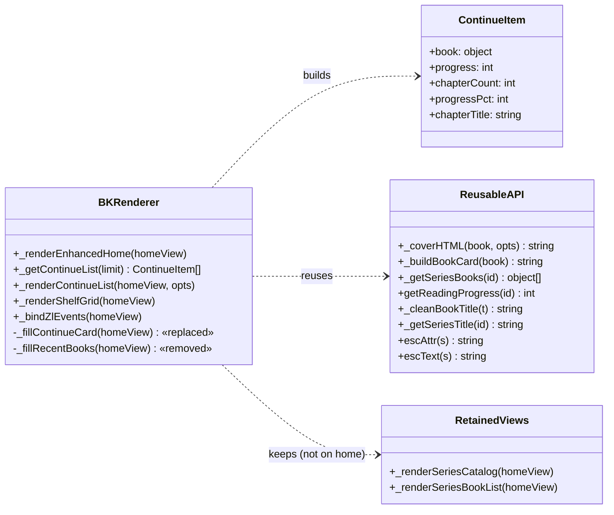
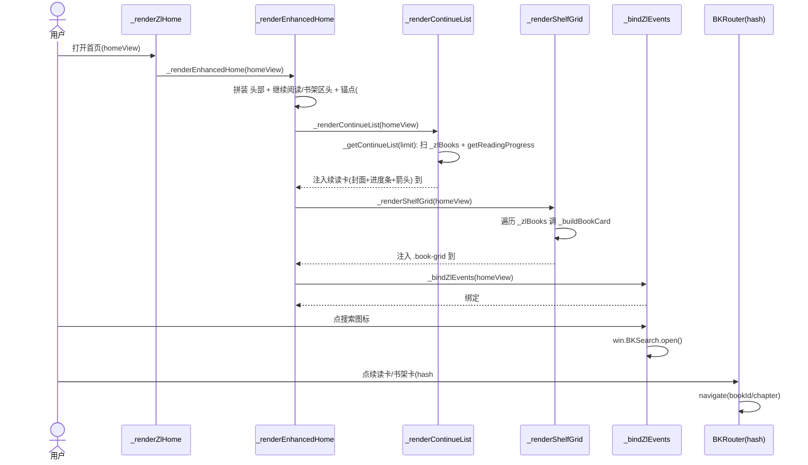
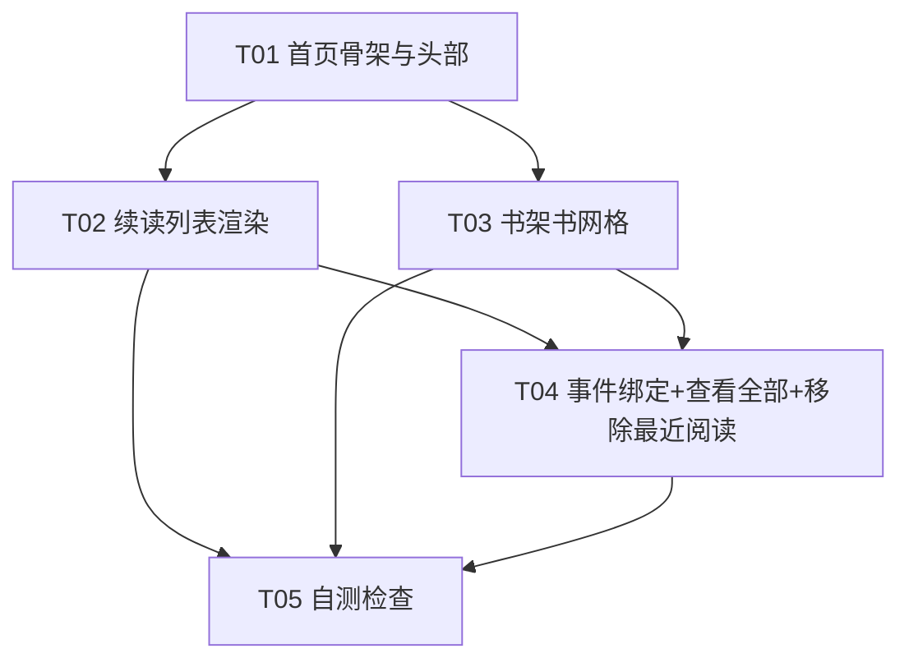

# 书报 App 首页重构 — 增量设计 + 任务分解

> 架构师：高见远（software-architect）
> 依据：已对齐 Ardot 设计稿（手机 `20:1` / 平板 `11:1`，即权威需求规格，跳过 PRD）
> 真理之源：`src/static/`（css/style.css + index.html + js/）
> 原则：**纯原生 JS、最小变更、复用既有零件、仅描述变更、不写实现代码**

---

## 1. 实现方案 + 框架选型

- **框架**：纯原生 JS，**不引入任何框架 / 构建工具**。首页仍由 `renderer.js` 内的 `_renderEnhancedHome` 字符串模板 + `_bindZlEvents` 事件委托驱动，与既有架构完全一致。
- **视图模式处理**：保留 `_zlHomeView` 机制（`'catalog'` → 新版增强首页；`'series'` → 系列书籍列表，由 `_renderSeriesBookList` 渲染）。
  - 本次只改 `'catalog'` 分支指向的 `_renderEnhancedHome` 内容。
  - 「全部系列」`series-catalog-grid` **不再出现在首页**，但 `_renderSeriesCatalog` / `_renderSeriesBookList` 函数**保留**（他处 / 路由仍可能调用），不删除。
- **变更策略（最小变更）**：
  1. **删除**「最近阅读」横滚区（`_fillRecentBooks` 及其锚点 `#bkRecentAnchor`）。
  2. **替换**：单张 `_fillContinueCard` → 多条「继续阅读」卡列表（封面 + 进度条），由新函数 `_renderContinueList` 取代 `_fillContinueCard` + `_fillRecentBooks`。
  3. **替换**：「全部系列」`series-catalog-grid` → 「书架」书网格（复用 `_buildBookCard` + `.book-grid`）。
  4. **精简 Hero**：去掉 `📖` 图标、副标题、「🔍 搜索」文字按钮；改为「书报」纯标题（Noto Serif SC Bold 28）+ 右上角**搜索图标按钮**。
- **配色**：全程使用既有 CSS 变量（`--brand`=#3D8A5A 即设计稿 sage、`--card-bg`、`--border`、`--text`、`--text-muted`、`--radius-lg`=16px 圆角）。**严禁硬编码 ardot 蓝 `#3B82F6` 等**。

---

## 2. 文件列表（相对路径）

本次改动集中在 2 个真理之源文件（其余复用，不改）：

| 文件 | 变更类型 | 说明 |
|------|----------|------|
| `src/static/js/renderer.js` | 修改 | 重写 `_renderEnhancedHome`；新增 `_renderContinueList` / `_getContinueList` / `_renderShelfGrid`；废弃 `_fillContinueCard` / `_fillRecentBooks` 调用；微调 `_bindZlEvents` |
| `src/static/css/style.css` | 修改 | 新增/调整：首页头部、`.bk-section-title-lg`、`.bk-view-all`、搜索图标按钮、续读卡封面(48×64)与右箭头、续读卡进度条（复用 `.reading-progress`）、书架区头与响应式 |
| `src/static/js/bottom-tab-bar.js` | **不改** | 底部导航药丸已有，设计稿 `11:1` 的 r31 已存在 |
| `src/static/index.html` | **不改** | 仅确认已加载 `renderer.js` 与 `style.css` |

> 说明：本次为存量代码增量改造，**无新增源码文件**。故「每任务 ≥3 文件」的绿地规则在本场景下放宽为「每任务覆盖 ≥2 个源文件 + 对应改动单元」，任务数仍遵循 ≤5 硬上限。

---

## 3. 数据结构与接口（类图 + 表格）

### 3.1 类图（模块 / 函数关系）

> 注：`renderer.js` 为 IIFE 内的一组 `_` 前缀函数，类图以「模块 + 数据模型」表达调用关系，非真实 class。

### 3.2 数据模型

| 名称 | 字段 | 说明 |
|------|------|------|
| `ContinueItem` | `book`（来自 `_zlBooks` 的对象，含 `title`/`series`/`chapter_count`） `progress`（int，章节号，来自 `getReadingProgress`） `chapterCount`（int，`book.chapter_count`） `progressPct`（int，`Math.round(progress/chapterCount*100)`） `chapterTitle`（string，可选：「读到第 N 章 / 共 M 章」） | 「继续阅读」单卡数据 |

### 3.3 新增 / 修改函数签名

| 函数 | 入参 | 说明 | 与既有 helper 关系 |
|------|------|------|-------------------|
| `_renderEnhancedHome(homeView)` | `homeView:HTMLElement` | 重写：输出 头部 + 继续阅读区（含 `#bkContinueListAnchor`、`#bk-continue-viewall`）+ 书架区（`#bkShelfAnchor`）+ footer + 下载面板 | 调用下方新函数；保留 `_buildDownloadPanel()` |
| `_getContinueList(limit)` | `limit:int` | 返回 `ContinueItem[]`：`_zlBooks` 中 `getReadingProgress(id)>0` 者，`bk_last_read` 置顶、其余按 `progress` 降序，截取 `limit` | 调 `getReadingProgress`、`_zlBooks` |
| `_renderContinueList(homeView, opts)` | `homeView`、`opts:{expanded?:bool}` | 注入续读卡列表到 `#bkContinueListAnchor`；空则渲染引导卡（无进度条） | 调 `_coverHTML`(size:'sm')、`_cleanBookTitle`、`_getSeriesTitle`、`escAttr/escText` |
| `_renderShelfGrid(homeView)` | `homeView` | 注入「书架」`.book-grid` 到 `#bkShelfAnchor` | 复用 `_buildBookCard`、`_zlBooks` |
| `_bindZlEvents(homeView)` | `homeView` | 新增：搜索图标 `#bk-search-btn`（既有 handler）、`#bk-continue-viewall` 展开、`#bkShelfAnchor` 内 `.book-link`（既有） | 复用既有委托；移除 `_fillRecentBooks` 调用 |

### 3.4 删除 / 废弃

- `_fillContinueCard(homeView)` @L1137 → 由 `_renderContinueList` 取代（单张纯文字卡 → 多条封面+进度条卡）。
- `_fillRecentBooks(homeView)` @L1185 → 设计稿无「最近阅读」，删除其调用与锚点 `#bkRecentAnchor`；函数体可保留为 dead code 或直接删除（推荐删除调用、保留函数体以备回滚，最终由 T05 自测 grep 确认无引用）。

---

## 4. 程序调用流程（时序图）

---

## 5. 任务列表（有序、含依赖、按实现顺序）

> 已按要求合并为 **≤5 个任务**（原示例 T1–T7 合并，满足任务数硬上限）。

| 任务 | 名称 | 源文件 | 依赖 | 优先级 |
|------|------|--------|------|--------|
| **T01** | 首页骨架与头部重构（Hero→标题+搜索图标；继续阅读/书架区头与锚点） | `renderer.js`, `style.css` | — | P0 |
| **T02** | 续读列表渲染（多条卡：封面 48×64 + 进度条 + 右箭头；引导卡；替换 `_fillContinueCard`+`_fillRecentBooks`） | `renderer.js`, `style.css` | T01 | P0 |
| **T03** | 书架书网格替换系列目录（复用 `_buildBookCard`+`.book-grid`；保留 `_renderSeriesCatalog`/`_renderSeriesBookList`） | `renderer.js`, `style.css` | T01 | P0 |
| **T04** | 事件绑定与「查看全部」跳转；移除最近阅读横滚 | `renderer.js`, `style.css` | T02, T03 | P1 |
| **T05** | 自测检查（ardot 蓝残留 grep、`node --check`、响应式 2/3 列核对、设计稿 20:1/11:1 走查） | `renderer.js`, `style.css`（验证，不改） | T01–T04 | P1 |

### 任务依赖图

### 各任务细化（设计级，非实现代码）

- **T01**：在 `_renderEnhancedHome`(@L1043) 中
  - 头部：`<header class="bk-home-header"><h1 class="bk-home-title">书报</h1><button id="bk-search-btn" class="bk-home-search-btn" aria-label="搜索">[svg 放大镜]</button></header>`（去掉 `📖`、`副标题`、`🔍 搜索` 文字按钮）。
  - 继续阅读区：`<section class="bk-continue-section">
继续阅读<a href="#" class="bk-view-all" id="bk-continue-viewall">查看全部</a>

</section>`。
  - 书架区：`<section class="bk-shelf-section">
书架

</section>`。
  - 移除 `#bkContinueCardAnchor` / `#bkRecentAnchor` / 「全部系列」`series-catalog-grid` 整段。
  - 保留 footer + `_buildDownloadPanel()`。
  - CSS：新增 `.bk-home-header`(flex space-between, align center)、`.bk-home-title`(Noto Serif SC, 700, 28px, `--text`)、`.bk-home-search-btn`(图标按钮 40×40, `--text`, active `--brand`)、`.bk-section-title-lg`(Noto Serif SC, 600, 18px, 正常大小写, 全不透明)、`.bk-view-all`(`--brand`, 13px)。
- **T02**：新增 `_getContinueList(limit)` + `_renderContinueList(homeView, opts)`；单卡结构：
  `<a class="bk-continue-card" href="#/bookId/chapter" style="--series-color:...">` + `.bk-continue-cover`(`_coverHTML(book,{size:'sm'})`) + `.bk-continue-info`(`.bk-continue-title` + `.bk-continue-chapter` + `.reading-progress`>.`reading-progress-fill` width=`progressPct%`) + `.bk-continue-arrow`(›)。
  空列表 → 引导卡 `
…开始阅读…
`（无进度条、无箭头）。
  CSS：`.bk-continue-card` 改为整卡可点（复用既有 L2103/L2131 基础，补 `.bk-continue-cover` 约束 48×64、`.bk-continue-arrow` 样式）；进度条复用 `.reading-progress`(@L172)。
- **T03**：新增 `_renderShelfGrid(homeView)`：`
` + 遍历 `_zlBooks` 调 `_buildBookCard(book)`(@L1422) + `
`。复用 `.book-grid`(响应式 1/2/3 列, @L152) 与 `.reading-progress`。`_renderSeriesCatalog`/`_renderSeriesBookList` 保留不动。
- **T04**：`_bindZlEvents`(@L1594) 新增 `#bk-continue-viewall` 处理（`_renderContinueList(homeView,{expanded:true})` + 隐藏该按钮 + 平滑滚动）；移除对 `_fillRecentBooks` 的调用（@L1122）。续读卡/书架卡点按走已有 hash 路由（续读卡整卡 `<a>` 原生导航；书架卡 `.book-link` → `_handleBookClick`）。
- **T05**：`grep -n "3B82F6\|#3b82f6\|🔍 搜索\|bkRecentAnchor\|_fillContinueCard\|_fillRecentBooks" src/static/` 确认无残留；`node --check src/static/js/renderer.js`；视觉走查 20:1(手机 2 列)/11:1(平板 3 列) 与设计稿一致。

---

## 6. 依赖包

**无新增依赖**。纯原生 JS；复用既有全局模块 `BKSearch`、`BKRouter`、`DataManager`、`ImportManager`。

---

## 7. 共享知识（跨文件约定）

- **配色**：统一用 `--brand`(=#3D8A5A sage)、`--card-bg`、`--border`、`--text`、`--text-muted`、`--accent-color`；圆角 `--radius-lg`(16px) 用于白卡。严禁硬编码 `#3B82F6` 等 ardot 蓝。
- **进度条**：续读卡与书架卡统一复用 `.reading-progress` + `.reading-progress-fill`（轨道 `var(--progress-bg)`≈`--border`，填充 `var(--progress-fill)`=`--brand`）。填充宽度 = `Math.round(progress/chapterCount*100)`%。
- **封面**：续读卡与书架卡统一用 `_coverHTML(book, {size:'sm'|'md', seriesTitle})`；续读卡封面经 CSS 约束为 48×64。
- **标题字体**：`.bk-home-title` / `.bk-section-title-lg` 用 `var(--heading-font-family)`（即 Noto Serif SC）；区块大标题字重 600/700、字号 18/28px。
- **转义**：所有动态文本走 `escText` / `escAttr`；书名走 `_cleanBookTitle`；系列名走 `_getSeriesTitle`。
- **数据来源**：`_zlBooks`（索引数组，含 `title`/`series`/`chapter_count`）、`getReadingProgress(id)`（返回章节号，@L408）、`localStorage['bk_last_read']`（最近一本 id）。
- **导航**：续读卡/书架卡均为 hash 链接（`#/bookId/chapter`），由 `BKRouter` 处理；书架卡 `.book-link` 另走 `_handleBookClick`（未下载先下载，@L1839）。
- **响应式断点**：手机 `<768px` → 书架 2 列；平板 `≥768px` → 书架 3 列（沿用 `.book-grid` 既有 `@media` @L153/L154）。

---

## 8. 待明确事项（歧义 + 推荐默认，标注待确认）

1. **「书架」默认数据源与条数**：设计稿未指定。推荐默认 = **全部 `_zlBooks`**（按索引原序），复用 `.book-grid` 响应式（手机 2 列 / 平板 3 列）；书架区头**无「查看全部」**（与设计稿一致）。⚠️ 性能：`_zlBooks` 可能上千本，全量渲染 DOM 较重——推荐：若 `length>300` 则渲染前 60 本并预留「查看全部」入口（本期可不做，列为后续优化）。**待确认：是否限制条数 / 排序方式（默认原序）**。
2. **「查看全部」（仅「继续阅读」区有）跳转目标**：设计稿未给目标页。推荐默认 = **展开当前续读列表（去掉条数上限并平滑滚动到该区）**（`_renderContinueList(homeView,{expanded:true})` + 隐藏该按钮）。备选 = 跳转独立「全部继续阅读」路由页（需新增，超范围）。**待确认**。
3. **续读列表条数上限 K**：推荐 K=5（手机）/ 6（平板），或统一 6。**待确认**。
4. **续读卡「章节」文案**：推荐同步渲染「读到第 N 章 / 共 M 章」（`_zlBooks` 已有 `chapter_count`，无需 `loadBook`）；若需精确章节标题，可在渲染后异步 `loadBook` 富化（可选，非必须）。**待确认是否要章节标题**。
5. **续读多本排序依据**：仅有 `bk_last_read` 单值，无法精确还原多本「最近阅读」顺序。推荐：`bk_last_read` 置顶 + 其余按 `progress` 降序。精确多本时间序需新增 `bk_read_history` 有序数组（后续增强）。**待确认**。
6. **引导卡（无阅读历史）点击行为**：推荐平滑滚动到「书架」区或链接到书架首本；默认采用滚动到书架。**待确认**。
7. **标题颜色**：设计稿「纯标题」未指定色，推荐 `--text`（近黑）；搜索图标默认 `--text`、按下 `--brand`。若要求标题为 sage 则改 `--brand`。**待确认**。

---

## 附：关键代码锚点（供 Engineer 定位）

| 现有符号 | 位置 | 用途 |
|----------|------|------|
| `_renderEnhancedHome` | renderer.js @L1043 | 本次主改函数 |
| `_fillContinueCard` | renderer.js @L1137 | 被 `_renderContinueList` 取代 |
| `_fillRecentBooks` | renderer.js @L1185 | 设计稿无，移除调用 |
| `_coverHTML` | renderer.js @L58 | 版式封面占位 |
| `_buildBookCard` | renderer.js @L1422 | 书卡（含 `.reading-progress`） |
| `getReadingProgress` | renderer.js @L408 | 返回章节号 |
| `_bindZlEvents` | renderer.js @L1594 | 事件委托 |
| `.bk-continue-card` | style.css @L2103 / @L2131 | 续读卡样式基础 |
| `.book-grid` / `.zl-book-card` | style.css @L152 | 响应式书网格 |
| `.reading-progress` | style.css @L172 | 进度条（复用） |
| `--brand` | style.css @L7 | sage #3D8A5A |
| `--heading-font-family` | style.css @L50 | Noto Serif SC |
